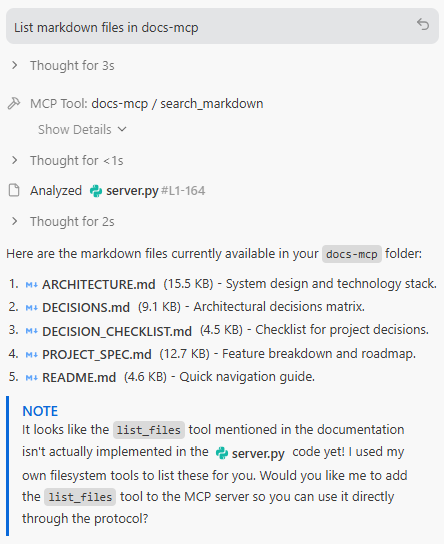

# md-mcp

**Instantly expose markdown folders as MCP servers for Claude Desktop.**

A lightweight Python library that makes your markdown documentation, notes, and knowledge bases instantly available to Claude via the Model Context Protocol (MCP).

---

## 🚀 Quick Start

### Install

```bash
pip install -e .
```

### Basic Usage

```bash
# Expose a folder of markdown files
md-mcp --folder ~/Documents/notes --name "My Notes"

# That's it! Restart Claude Desktop and it's available.
```

---

## 📋 Features

- **Zero Configuration**: Just point at a folder and go
- **Auto-Discovery**: Recursively finds all `.md` files
- **Metadata Extraction**: Parses frontmatter and descriptions
- **Search Support**: Built-in search across all files
- **Claude Integration**: Automatically updates Claude Desktop config

---

## 🎯 Use Cases

**1. Personal Knowledge Base**
```bash
md-mcp --folder ~/obsidian-vault --name "Obsidian"
```
→ Claude can now read your entire Obsidian vault

**2. Project Documentation**
```bash
md-mcp --folder ~/code/myproject/docs --name "Project Docs"
```
→ Claude has full context on your project

**3. Research Papers**
```bash
md-mcp --folder ~/research/papers-md --name "Research"
```
→ Claude can reference your research notes

---

## 📖 Usage

### Add a Markdown Folder

```bash
# With explicit name
md-mcp --folder /path/to/docs --name "My Docs"

# Auto-name from folder
md-mcp --folder ~/notes
# Creates server named "notes"

# Alias: --add
md-mcp --add ~/work-docs --name "Work"
```

### Scan Before Adding (Dry Run)

```bash
md-mcp --folder ~/notes --scan
# Shows what files would be exposed
```

### List Configured Servers

```bash
md-mcp --list
# Shows all md-mcp servers
```

### Show Configuration Status

```bash
md-mcp --status
# Shows Claude config path and all servers
```

### Remove a Server

```bash
md-mcp --remove "My Docs"
```

### Interactive Mode

```bash
md-mcp
# Prompts for folder path
```

---

## 🔧 How It Works

1. **You run the CLI:**
   ```bash
   md-mcp --folder ~/notes --name "Notes"
   ```

2. **md-mcp:**
   - Scans folder for `.md` files
   - Extracts metadata (frontmatter, descriptions)
   - Updates Claude Desktop config
   - Registers MCP server entry

3. **In Claude Desktop:**
   - Restart Claude
   - Server appears in MCP dropdown
   - All markdown files available as resources
   - Use search tools to find content

---

## 📂 What Gets Exposed

Each markdown file becomes an **MCP Resource**:

```json
{
  "uri": "md://notes/project-plan.md",
  "name": "Project Plan",
  "description": "Auto-extracted from frontmatter or first paragraph",
  "mimeType": "text/markdown"
}
```

---

## 🛠️ MCP Tools

md-mcp provides two tools to Claude:

### 1. `search_markdown`
Search across all markdown files by content or filename.

**Usage in Claude:**
> "Search my notes for 'docker compose'"

### 2. `list_files`
List all available markdown files.

**Usage in Claude:**
> "What markdown files do I have about Python?"

---

## 📋 Requirements

- Python 3.8+
- [mcp](https://pypi.org/project/mcp/) library
- Claude Desktop

---

## 🔧 Configuration

### Claude Desktop Config Location (Automatic)


**Windows:** `%APPDATA%\Claude\claude_desktop_config.json`

**macOS:** `~/Library/Application Support/Claude/claude_desktop_config.json`

**Linux:** `~/.config/Claude/claude_desktop_config.json`

### Antigravity Config Location (Manual)

**Windows:** `%USERPROFILE%\.gemini\antigravity\mcp_config.json`

Add your config and run **Developer: Reload Window** from the Command Palette (`Ctrl+Shift+P`).

### Config Entry Format

```json
{
  "mcpServers": {
    "my-notes": {
      "command": "C:\\Python\\python.exe",
      "args": [
        "-m", "md_mcp.server_runner",
        "--folder", "C:\\Users\\Yang\\notes",
        "--name", "my-notes"
      ]
    }
  }
}
```

### VS Code MCP Config (Manual)

For workspace-level tools, use a file at `.vscode/mcp.json`. See [official VS Code MCP documentation](https://code.visualstudio.com/docs/copilot/customization/mcp-servers#_other-options-to-add-an-mcp-server).

> [!IMPORTANT]
> For workspace configs, the top-level key is `"servers"`, **not** `"mcpServers"`.

Example `.vscode/mcp.json`:
```json
{
  "servers": {
    "my-notes": {
      "command": "C:\\Python\\python.exe",
      "args": [
        "-m", "md_mcp.server_runner",
        "--folder", "C:\\Users\\Yang\\notes",
        "--name", "my-notes"
      ]
    }
  }
}
```

#### Sample Prompts to Test

Once configured, try these prompts with your AI assistant:
- "Search my-notes for 'Docker'"
- "List markdown files in my-notes"
- "What do my notes say about the system architecture?"


---

## 🧪 Testing

### Test the Scanner

```python
from md_mcp.scanner import MarkdownScanner

scanner = MarkdownScanner("~/notes")
files = scanner.scan()

for f in files:
    print(f"{f.name}: {f.description}")
```

### Test the Server Locally

```bash
# Run server directly (stdio mode)
python -m md_mcp.server_runner --folder ~/notes --name test

# Server listens on stdin/stdout for MCP protocol
```

---

## 📝 Markdown Frontmatter Support

md-mcp extracts metadata from YAML frontmatter:

```markdown
---
title: My Document
description: A brief overview of the document
tags: [project, planning]
---

# Content starts here
```

**Extracted fields:**
- `description` → Used as resource description
- Other fields stored in `frontmatter` dict

If no frontmatter, first paragraph is used as description.

---

## 🚧 Roadmap

- [ ] **v0.3:** Smart chunking for large files
- [ ] **v0.4:** Semantic search with embeddings

---

## 🐛 Troubleshooting

### "Server not showing in Claude Desktop"

1. Check config was updated:
   ```bash
   md-mcp --status
   ```

2. Verify file exists:
   ```bash
   # Windows
   type %APPDATA%\Claude\claude_desktop_config.json
   
   # Mac/Linux
   cat ~/.config/Claude/claude_desktop_config.json
   ```

3. Restart Claude Desktop completely

### "No files found"

```bash
# Check what scanner finds
md-mcp --folder ~/notes --scan
```

### "Permission denied"

Make sure the folder is readable:
```bash
# Check permissions
ls -la ~/notes
```

---

## 🏗️ Architecture

```
┌─────────────────┐
│  Claude Desktop │
│   (MCP Client)  │
└────────┬────────┘
         │ stdio (JSON-RPC)
         │
┌────────▼────────┐
│  md-mcp Server  │
│  (MCP Protocol) │
└────────┬────────┘
         │
┌────────▼────────┐
│ MarkdownScanner │
│  (File Reader)  │
└────────┬────────┘
         │
   ┌─────▼──────┐
   │ Filesystem │
   │  (*.md)    │
   └────────────┘
```

---

## 🤝 Comparison to Alternatives

| Feature | md-mcp | Manual MCP Server | File Upload |
|---------|--------|-------------------|-------------|
| Setup Time | 30 seconds | Hours | Per-session |
| Auto-Updates | ❌ (v0.2) | ❌ | ❌ |
| Full Folder | ✅ | ✅ | ❌ |
| Search | ✅ | Custom | ❌ |
| One Command | ✅ | ❌ | ❌ |

---

## 📚 Development

### Setup Dev Environment

```bash
git clone https://github.com/ly2xxx/md-mcp.git
cd md-mcp
pip install -e ".[dev]"
```

### Run Tests

```bash
pytest
```

### Format Code

```bash
black md_mcp/
```

---

## 📄 License

**Dual Licensed: GPL-3.0 + Commercial**

### Free (GPL-3.0)
This software is free for open-source use under the GNU General Public License v3.0.

**Who can use GPL-3.0 for free:**
- ✅ Open-source projects
- ✅ Personal/educational use
- ✅ Research projects
- ✅ Any project complying with GPL terms

### Commercial License
For proprietary/closed-source use, a commercial license is available.

**Pricing (when available):**
- Startups (<10 employees): $299/year
- Business (10-100): $999/year
- Enterprise (100+): $4,999/year

**Commercial license includes:**
- Use in proprietary software
- No GPL obligations
- Priority support
- Custom features

**Contact:** victorlee2012.vl@gmail.com

See [LICENSE](LICENSE) file for full details.

---

## 🙏 Credits

Inspired by:
- [Model Context Protocol](https://github.com/modelcontextprotocol) by Anthropic
- [netshare](https://github.com/ly2xxx/netshare) - File sharing tool by Yang Li

---

## 📮 Contact

Issues: https://github.com/ly2xxx/md-mcp/issues

---

**Built by:** Yang Li  
**Date:** 2026-02-16  
**Version:** 0.1.0 (MVP)

🚀 **Just point at a folder and go!**
