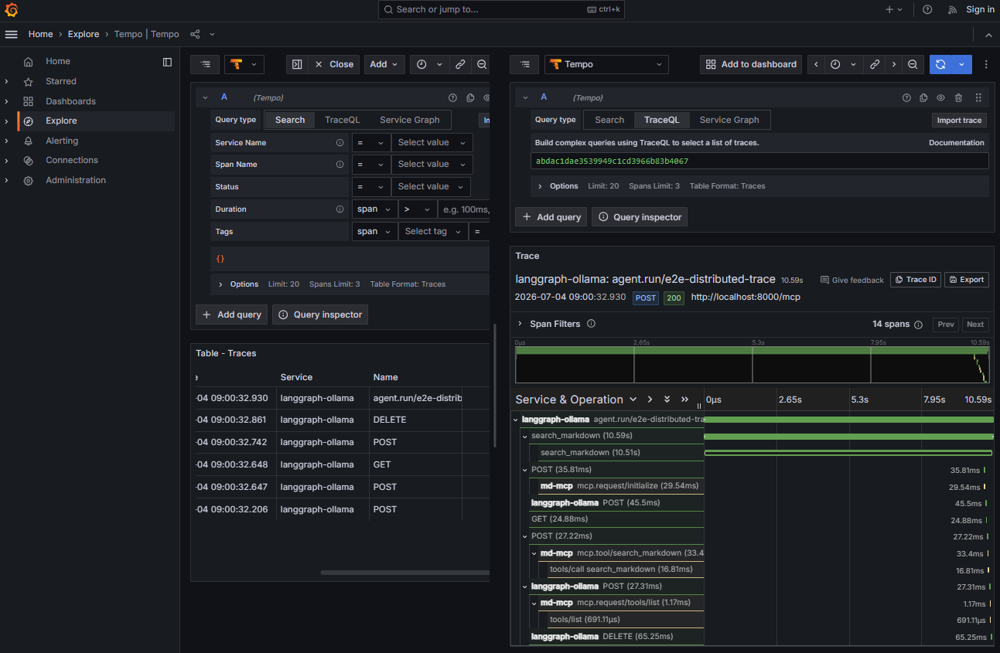

# Demo Guide — md-mcp

> **Interview angle: end-to-end delivery — prototype to production distribution.**
> This is the one project that goes all the way: a *published* PyPI package, a
> Docker image with healthchecks, and Kubernetes manifests. It demonstrates the
> JD's "prototyping → production" and "reliability, monitoring, deployment"
> lead responsibilities concretely.

## JD skills this project demonstrates

| JD skill | Where it lives |
|---|---|
| **PyPI packaging / release engineering** | Published `md-mcp` v1.0.5 (`pip install md-mcp`); `pyproject.toml` with metadata/classifiers/optional extras; release pipeline in `pypi-build/` (`build.sh`, `bump-version.sh`, `deploy-test.sh`, `deploy-prod.sh`, `verify-install.sh`) |
| **Docker + IaC / CI-CD adjacency** (Essential) | `docker/` — `Dockerfile`, `docker-compose.yml`, `entrypoint.py`, `healthcheck.py`, **`k8s/`**, `DOCKERHUB.md` |
| Agentic tooling / MCP (Desirable) | FastMCP server exposing markdown to any MCP client (Claude Desktop) |
| Embeddings / semantic search (Essential) | optional `semantic.py` (sentence-transformers) + `chunking.py` — "RAG-lite" |
| Clean architecture | tidy module split: `scanner`, `chunking`, `semantic`, `server`, `config`, `web` |

## Demo flow (≈5 min)

**Packaging / distribution story:**
```bash
# It's real — install the published package from PyPI
pip install md-mcp
md-mcp --web                      # visual dashboard; point at a folder and go
# or expose a folder via CLI
md-mcp --folder ~/Documents/notes --name "My Notes"
```

**Release pipeline (show the maturity):**
```bash
ls pypi-build/                    # build / bump-version / deploy-test / deploy-prod / verify-install
```

**Containerised deployment:**
```bash
cd docker
docker compose up -d              # Dockerfile + healthcheck + entrypoint
ls k8s/                           # Kubernetes manifests
```

**Optional semantic search:**
```bash
pip install md-mcp[semantic]      # enables sentence-transformers chunked search
```

## Talking points (Lead / Architect framing)

- **"I take things to production, not just to a demo."** A real PyPI release
  with versioning/bump scripts and an install-verification step — engineering
  discipline, not a one-off script.
- **Deployment maturity** — Dockerfile + healthcheck + entrypoint + k8s
  manifests = the reliability/observability/deployment/auto-scalability ownership the JD asks of
  a Lead.
- **Graceful optionality** — semantic search degrades to keyword search if
  `sentence-transformers` isn't installed; production code that never hard-fails.
- **Privacy by design** — files stay local, real-time updates reflected; ties
  into "secure AI solution design / responsible data handling. Shared memory.md"



## The one-liner
> "An MCP server I shipped end-to-end — published to PyPI, containerised with
> healthchecks, and deployable to Kubernetes — proving I own the path from
> prototype to production."
