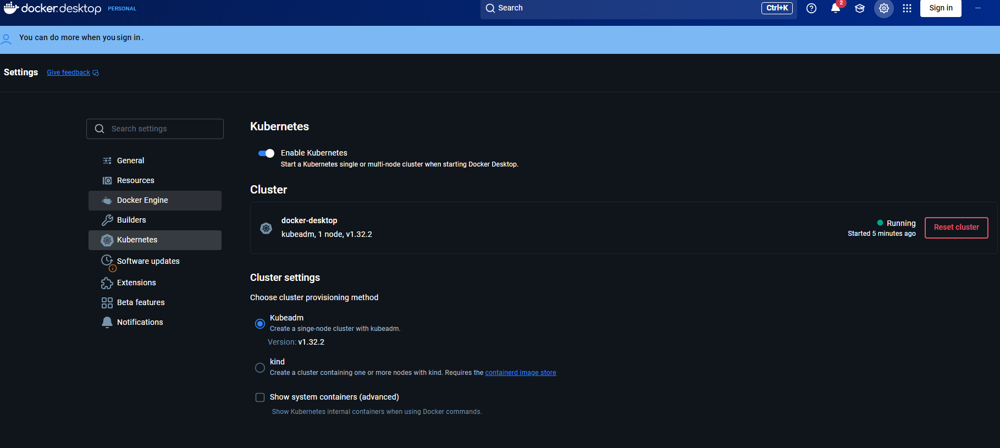

# Kubernetes Auto-Scaling Experiment

This folder contains a Helm chart to deploy the `md-mcp` server to your local Docker Desktop Kubernetes cluster, complete with a **Horizontal Pod Autoscaler (HPA)**.

## Prerequisites

1. Open Docker Desktop settings.
2. Navigate to the **Kubernetes** tab.
3. Check **Enable Kubernetes** and click Apply & Restart.
4. Ensure you have [Helm installed](https://helm.sh/docs/intro/install/) (`winget install Helm.Helm` on Windows). To check: `helm version`

## Step 1: Install the Metrics Server

For Kubernetes to auto-scale, it needs to know how much CPU/Memory your pods are using. The `metrics-server` provides this data.

Run these commands in your terminal:

```bash
# Add the official metrics-server Helm repository
helm repo add metrics-server https://kubernetes-sigs.github.io/metrics-server/
helm repo update

# Install metrics-server. 
# We MUST pass --kubelet-insecure-tls because Docker Desktop uses self-signed certs.
helm install metrics-server metrics-server/metrics-server \
  --set args={--kubelet-insecure-tls} \
  --namespace kube-system

helm install metrics-server metrics-server/metrics-server `
  --set "args={--kubelet-insecure-tls}" `
  --namespace kube-system
```

Verify it's running:

```bash
kubectl get pods -n kube-system -l app.kubernetes.io/name=metrics-server
```

*(Wait until it shows `1/1 Running`)*

## Step 2: Deploy md-mcp via Helm

Now we deploy `md-mcp`. The Helm chart is located in `helm/md-mcp`.

1. Open a terminal in this `kubernetes` folder:

   ```bash
   cd h:\code\yl\md-mcp\kubernetes
   ```
2. Open `helm/md-mcp/values.yaml` and update `mdFolder` to point to the exact Windows path containing the markdown files you want to test (e.g. `H:/code/yl/interview-prep/notes`). Use forward slashes.
3. Install the chart:

   ```bash
   helm install my-md-mcp ./helm/md-mcp

   Check:  kubectl describe pod -l app.kubernetes.io/name=md-mcp
   ```
4. Check your deployment and pods:

   ```bash
   kubectl get pods
   kubectl get hpa
   ```

   *Note: It might take a minute or two for the HPA to register the CPU usage from the metrics server. Initially, it might show `<unknown>/70%`, but it will soon show something like `0%/70%`.*

## Step 3: Test Auto-Scaling!

Right now, you have `1` replica running because the CPU load is zero.

To trigger the autoscaler, you need to generate HTTP traffic to the pod. Since the service is exposed as a `ClusterIP` on port `8000`, we can port-forward it to your localhost:

```bash
kubectl port-forward svc/my-md-mcp 8001:8000
```

Now, open another terminal and bombard it with requests! You can use a tool like `curl` in a loop, or an actual load testing tool like `hey` or `k6`. Or even a quick PowerShell loop:

```powershell
while ($true) { Invoke-WebRequest -Uri http://localhost:8001/mcp -UseBasicParsing | Out-Null }
```

As the CPU usage rises above `70%`, watch your HPA spin up new pods:

```bash
# Watch the HPA status live
kubectl get hpa -w
```

You will see the replica count jump from 1 up to a maximum of 5 as Kubernetes automatically scales your application to handle the load!

## Cleanup

To remove everything and clean up:

```bash
helm uninstall my-md-mcp
```
