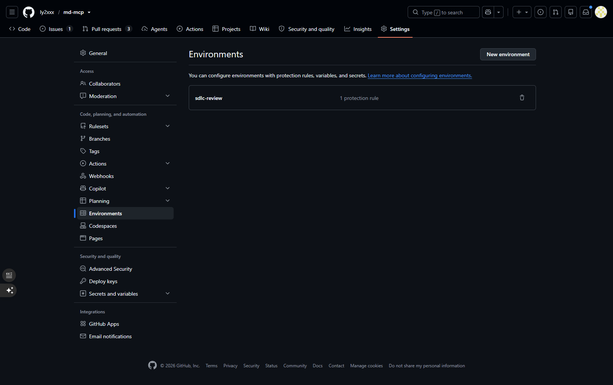

# AI-native SDLC pipeline

One GitHub Actions run takes a feature from a one-line idea to a pull request.
Ollama Cloud writes the design, a builder writes the code, and deterministic
checks decide whether it is done. The pipeline is the shared one in
[`ly2xxx/.github`](https://github.com/ly2xxx/.github/tree/main/actions/sdlc-stage);
this repository only calls it (`.github/workflows/sdlc.yml` and `sdlc-phase.yml`).

```text
Actions → SDLC Pipeline → Run workflow (idea), or an issue labelled "sdlc"      one run, one line
  1 · Ollama writes intent.md → ✋ → 2 · spec.md → ✋ → 3 · plan.md → ✋
  4 · ⏸ Hand off and wait for the build     tags sdlc/<feature>/approved, then waits
        the builder: Claude Code (builder=claude) or a person (builder=human)
        for each phase: phase/<feature>/<n> → PR into feature/<feature> → SDLC Phase Check → merge
        when build-log.md logs every phase, the same run carries on:
  5 · Verify the build → 5 · Ollama reviews the build → 6 · ✋ Open the pull request
```

Everything lands on one branch, `feature/<feature>`, in `sdlc/features/<feature>/`.
The ✋ jobs wait on the `sdlc-review` environment, so the run pauses at each one
until you approve. Waiting there uses no runner minutes. Step 4 doesn't use a
gate: it is a job that polls the feature branch for up to three hours after
you approve the plan.

## Setup (once)

1. **Turn on HITL approval (Settings → Environments):**
   - Click **New environment** and name it `sdlc-review`:

     

   - Under **Deployment protection rules**, check **Required reviewers** and add yourself as a reviewer. Leave **Prevent self-review** unchecked (so you can approve runs triggered by your own actions), then click **Save protection rules**:

     
2. **Settings → Actions → General → Allow GitHub Actions to create and approve
   pull requests**, or add an `SDLC_PR_TOKEN` secret (a fine-grained token with
   contents and pull requests write). With the token, CI also runs on the PR.
   With neither, step 6 fails but prints the pull request's title and body in
   its log, so it can be opened by hand.
3. `OLLAMA_API_KEY` secret. Optional variables: `OLLAMA_MODEL` (default
   `deepseek-v4-flash:cloud`) and `OLLAMA_THINK` (`false` stops a reasoning
   model thinking for minutes).
4. For issue starts, an `sdlc` label. Only people with triage or write access
   can add it, so outside issues can't start a run.

## Run a feature

1. **Start.** Run **SDLC Pipeline** with an idea and a builder, or open an issue
   labelled `sdlc` whose title is the idea.
2. **At each ✋ Review job**, open the run. The job before it shows the new
   document in its summary with **View** and **Edit on the branch** links. Edit
   it there if it needs changing, then **Review deployments → Approve**. The next
   stage reads the branch after you approve, so it sees your edits. **Reject**
   stops the run.
3. **Build, while step 4 waits.** Step 4 freezes the approved documents as the
   `sdlc/<feature>/approved` tag, lists the phases in its summary, and waits.
   - *Claude Code:* with the `sdlc-github` skill (a claude.ai account skill, not
     part of this repository), say "use sdlc-github to build feature
     `<feature>`" in a session on this repository, or give it an idea and it
     opens the `sdlc` issue itself. It builds each phase on its own branch and
     pull request, waits for the Phase check before it merges, and reports the
     pull request step 6 opens.
   - *A person:* follow the hand-off summary. Build each phase, run the local
     check it prints, and push, either straight to `feature/<feature>` or through
     `phase/<feature>/<n>` pull requests, which get the Phase check. Add a
     `## Phase <n>: ...` section to `build-log.md` for each phase; the plan's
     "Hand back" section says what goes in it.
4. **Carry on.** When `build-log.md` logs every phase, step 4 finishes and the
   same run verifies the whole branch and has Ollama review the diff against
   the spec. **6 · ✋ Open the pull request** pauses so you can read the
   verification report and the review, then opens the pull request into `main`.
   If step 4 stopped waiting first, run it again with the feature and start
   `build`.

| Run workflow with | Does |
| :-- | :-- |
| idea | a new feature, numbered after the highest existing one |
| idea + feature | revises that feature's intent, then spec and plan again, and re-freezes |
| feature | the first missing document, or the build run if all three exist |
| feature + start | that stage onwards: `spec` or `plan` redoes the design, `build` runs only steps 5-6 |
| an issue labelled `sdlc` | the title is the idea; `feature: <name>` in the body revises that feature, and with `start: build` runs only steps 5-6 |

Features 002-004 were designed by the old workflow and have no approved tag.
To build one, merge `main` into its branch (so its phase pull requests get the
Phase check), then run it with the feature and start `plan`, which redoes the
plan and freezes it.

## What the checks hold the builder to

- **The approved plan.** Verification reads `plan.md` from the
  `sdlc/<feature>/approved` tag and fails if `intent.md`, `spec.md` or `plan.md`
  changed on the branch. A plan that can't be built gets regenerated by the plan
  stage, never edited by the builder.
- **Scope.** A changed file outside the phase's `targets`, or any `frozen` file,
  fails. `build-log.md` is the builder's own and is exempt.
- **Tests.** Each phase's Verify block and the whole suite
  (`python -m pytest -q --ignore=sample-client`) must exit zero, and a suite
  that collects no tests fails.
- **Coverage.** The plan has a row for every "Done when" item in `intent.md`; one
  it can't deliver is marked `NOT COVERED`, for you to see at the plan review.
- **Ollama's review** of the build is advisory. It goes into the pull request.

## Guard rails

- **No model-written code runs in Actions.** The model writes documents; people
  approve them, and the builder writes the code.
- **"Tests pass" is an exit code**, from each phase's Verify block and the whole
  suite, never anyone's opinion.
- **Permissions per job.** Only the document jobs and step 4 (which pushes the
  tag) can write to the repository; verification, the review and the Phase
  check are read-only; only the last job can open a pull request.

## Known limits

- An approval comment doesn't reach the next stage. To steer a stage, edit the
  document on the branch before approving.
- The Verify commands come from the approved plan and run on the runner, so
  read them at the plan review like any other code.
